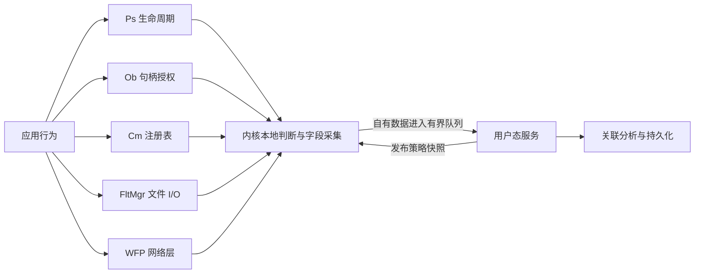
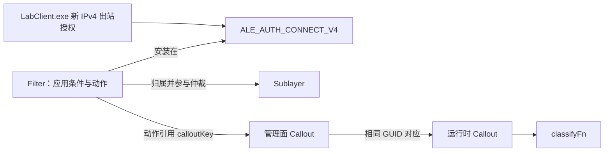
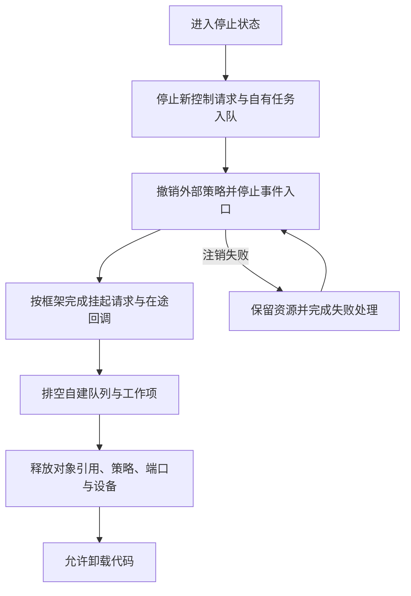

# 概念

EDR 驱动层在进程生命周期、对象句柄授权、注册表、文件 I/O 和网络处理节点采集信息，并在接口允许的阶段实施本地访问控制。本文限定 Windows x64 的公开驱动接口，采用 Windows 11 测试虚拟机作为学习路径。

狭义 Hook 修改原有执行路径；系统回调登记通知函数；Minifilter 与 WFP 则提供带有对象、排序和生命周期的过滤框架。本文使用后两类机制，不涉及修改内核代码、未公开回调数组或第三方驱动内部结构。

## 观测与控制面

| 接口或框架 | 关注对象 | 当前节点的控制方式 |
| --- | --- | --- |
| Ps | 进程、线程生命周期与镜像映射 | 进程 Ex 通知可修改创建状态；线程、镜像回调主要提供通知。 |
| Ob | 受支持对象的句柄创建、复制 | Pre 削减文档允许修改的访问权限；Post 读取结果。 |
| Cm | 注册表操作 | Pre 可拒绝操作；接管操作或改写 Post 结果须遵循输出与所有权约束。 |
| Minifilter / FltMgr | 文件系统 I/O | 按操作类型参与 Pre/Post，放行、完成或在受支持路径挂起请求。 |
| WFP | 网络授权、数据流与数据包 | Filter 匹配 Layer 上的条件，直接执行动作或引用 Callout。 |

这些入口覆盖不同语义节点。线程创建记录需要与其他证据关联后才能形成检测结论；单个回调不能证明某段行为具有恶意性。[进程与线程管理器](https://learn.microsoft.com/zh-cn/windows-hardware/drivers/kernel/windows-kernel-mode-process-and-thread-manager)、[注册表回调](https://learn.microsoft.com/en-us/windows-hardware/drivers/ddi/wdm/nc-wdm-ex_callback_function)、[文件 I/O 处理](https://learn.microsoft.com/en-us/windows-hardware/drivers/ifs/processing-i-o-operations)。



图中的队列和策略发布是产品架构关系；后文机制节选不实现完整事件系统，也不把用户态分析设计成所有回调的同步依赖。

## 对象、句柄与身份

内核进程对象表示进程实体；句柄是某个句柄表中的访问入口，携带一组授权。同一进程对象可以同时被多个权限不同的句柄引用。对象身份、调用者身份和句柄接收者身份需要分别保留。[Ob 操作参数](https://learn.microsoft.com/en-us/windows-hardware/drivers/ddi/wdm/ns-wdm-_ob_pre_operation_information)。

| 操作 | Ps 生命周期侧 | Ob 授权侧 |
| --- | --- | --- |
| 创建进程 | 新进程创建通知 | 同一业务链还可能建立进程、线程句柄。 |
| 打开已有进程 | 目标进程没有因此重新创建 | 创建指向目标的新句柄。 |
| 复制已有句柄 | 目标进程没有因此重新创建 | 为接收方句柄表处理复制授权。 |
| 使用已有句柄 | 按实际生命周期触发 | 每次使用句柄不会都重新经过句柄创建回调。 |

# 开发环境

开发需要配套的 Visual Studio、SDK、WDK；SDK 与 WDK 的构建号必须匹配，具体组合以[当前 WDK 支持表](https://learn.microsoft.com/en-us/windows-hardware/drivers/download-the-wdk)为准。驱动签名、代码完整性配置、Minifilter 安装信息及 WFP 策略权限都属于运行前提。

**以下均为机制节选，未编译、未加载、未运行。** 本机没有可用 WDK，本次只做文档生成与官方 API 核对。代码使用真实 C 类型和 API，但省略 `DriverEntry`、INF、控制接口、日志持久化及重复测试装配，不能直接拼成可部署驱动。各入口由驱动初始化或管理路径串行调用；成功注册后保持状态有效，注销成功后才释放依赖。代码中的固定对象和规则仅用于自有实验目标。

# 项目结构

下面按职责组织学习代码；模块边界不要求对应独立 `.sys`。实际集成可将 Minifilter 与其他模块放在同一驱动，也可分别部署。

```text
EdrLab/
├─ driver/
│  ├─ entry.c        # 生命周期协调、部分失败回滚
│  ├─ process.c      # Ps 通知
│  ├─ object.c       # Ob 句柄过滤
│  ├─ registry.c     # Cm 注册表过滤
│  ├─ file.c         # Minifilter
│  ├─ network.c      # WFP 运行时 Callout
│  ├─ events.c       # 有界队列、数据所有权与消费
│  └─ EdrLab.inf     # 服务与过滤实例安装配置
├─ shared/protocol.h # 受限控制协议、事件与共享 GUID
└─ service/
   ├─ main.c         # 策略发布、事件消费
   └─ wfp_policy.c   # WFP 管理对象
```

# 进程、线程与镜像通知

Ps 通知分别描述进程创建/退出、线程创建/退出和镜像映射。下面把参数解释、处理、注册与注销放在同一条机制链中。

## 进程创建与退出

机制节选使用 `PsSetCreateProcessNotifyRoutineEx`。入口 `DeniedImage` 由初始化方提供，是与通知名称空间一致的完整实验镜像名称；其字符串存储须保持只读、常驻，直至注销成功。示例采用精确名称匹配，名称不可用时放行。

```c
#include <ntddk.h>

static UNICODE_STRING gDeniedImage;
static BOOLEAN gProcessRegistered;

static VOID OnProcess(PEPROCESS Process, HANDLE ProcessId,
                      PPS_CREATE_NOTIFY_INFO Info)
{
    UNREFERENCED_PARAMETER(Process);
    UNREFERENCED_PARAMETER(ProcessId);
    if (Info == NULL) {
        // Process / ProcessId 是退出的目标进程；这里没有创建信息。
        // ...：省略退出事件的序列化和上报。
        return;
    }

    // ParentProcessId 是父进程；CreatingThreadId 是实际创建者进程/线程。
    // FileObject 对应可执行文件；ImageFileName、CommandLine 都要处理缺失。
    // FileOpenNameAvailable 为真才以准确的打开名称执行这条实验策略。
    if (NT_SUCCESS(Info->CreationStatus) && Info->FileOpenNameAvailable &&
        Info->ImageFileName != NULL &&
        RtlEqualUnicodeString(Info->ImageFileName, &gDeniedImage, TRUE)) {
        Info->CreationStatus = STATUS_ACCESS_DENIED;
    }
    // 回调返回 VOID：阻断写在 CreationStatus，不是函数返回值。
    // ...：省略采集字段的深拷贝、日志格式化和事件队列；不外借 Info 指针。
}

NTSTATUS StartProcess(PCUNICODE_STRING DeniedImage)
{
    if (gProcessRegistered) return STATUS_INVALID_DEVICE_STATE;
    if (DeniedImage == NULL || DeniedImage->Buffer == NULL ||
        DeniedImage->Length == 0) return STATUS_INVALID_PARAMETER;
    gDeniedImage = *DeniedImage;  // 借用入口约定的只读、常驻字符串。
    NTSTATUS status = PsSetCreateProcessNotifyRoutineEx(OnProcess, FALSE);
    gProcessRegistered = NT_SUCCESS(status);
    if (!gProcessRegistered) RtlZeroMemory(&gDeniedImage, sizeof(gDeniedImage));
    return status;
}

NTSTATUS StopProcess(VOID)
{
    if (!gProcessRegistered) return STATUS_SUCCESS;
    // 不能在 OnProcess 内调用；成功返回前等待在途回调结束。
    NTSTATUS status = PsSetCreateProcessNotifyRoutineEx(OnProcess, TRUE);
    if (NT_SUCCESS(status)) {
        gProcessRegistered = FALSE;
        RtlZeroMemory(&gDeniedImage, sizeof(gDeniedImage));
    }
    return status;  // 失败时调用者必须保留代码和策略存储。
}
```

`CreationStatus` 仍可能被后续检查影响；本回调放行只表示未在此处拒绝。Ex 注册要求回调映像具备 `IMAGE_DLLCHARACTERISTICS_FORCE_INTEGRITY`，对应链接选项 `/INTEGRITYCHECK`，并须满足驱动签名要求。[Ex 注册契约](https://learn.microsoft.com/en-us/windows-hardware/drivers/ddi/ntddk/nf-ntddk-pssetcreateprocessnotifyroutineex)、[创建信息字段](https://learn.microsoft.com/en-us/windows-hardware/drivers/ddi/ntddk/ns-ntddk-_ps_create_notify_info)。

| 进程通知接口 | 差异 |
| --- | --- |
| `PsSetCreateProcessNotifyRoutine` | 传统通知参数没有 `CreationStatus`。 |
| `PsSetCreateProcessNotifyRoutineEx` | Vista SP1 / Server 2008 起提供创建信息与否决能力。 |
| `PsSetCreateProcessNotifyRoutineEx2` | Windows 10 1703 起可通过通知类型覆盖子系统进程；对应名称、文件对象、命令行可能缺失。 |

Ex2 注销应沿用原通知类型与回调，并设置 `Remove = TRUE`。[传统接口](https://learn.microsoft.com/en-us/windows-hardware/drivers/ddi/ntddk/nf-ntddk-pssetcreateprocessnotifyroutine)、[Ex2](https://learn.microsoft.com/en-us/windows-hardware/drivers/ddi/ntddk/nf-ntddk-pssetcreateprocessnotifyroutineex2)。

## 线程与镜像观测

这一机制节选用原子计数展示通知到达后的实际处理，事件详情输出作为非核心部分省略。两个 `Set*` 入口各管理自己的注册状态；成功启用一次，再成功停用一次，才能卸载代码。

```c
// 使用上一节的 ntddk.h；全局状态在任何注册前已经零初始化。
static volatile LONG gThreadCreates, gThreadExits, gUserImages, gKernelImages;
static BOOLEAN gThreadRegistered, gImageRegistered;

static VOID OnThread(HANDLE ProcessId, HANDLE ThreadId, BOOLEAN Create)
{
    // ProcessId / ThreadId 标识发生生命周期变化的线程及所属进程。
    UNREFERENCED_PARAMETER(ProcessId);
    UNREFERENCED_PARAMETER(ThreadId);
    if (Create) InterlockedIncrement(&gThreadCreates);
    else InterlockedIncrement(&gThreadExits);
    // ...：省略线程事件输出；此接口没有拒绝创建的状态字段。
}

static VOID OnImage(PUNICODE_STRING FullImageName, HANDLE ProcessId,
                    PIMAGE_INFO ImageInfo)
{
    UNREFERENCED_PARAMETER(FullImageName); // 名称可能为 NULL。
    UNREFERENCED_PARAMETER(ProcessId);     // 驱动镜像加载时为 0。
    if (ImageInfo->SystemModeImage) InterlockedIncrement(&gKernelImages);
    else InterlockedIncrement(&gUserImages);
    // ImageBase / ImageSize 描述映射范围；回调发生在映射后、入口调用前。
    // ...：省略名称和映射字段的复制、事件输出。
}

NTSTATUS SetThreadMonitor(BOOLEAN Enable)
{
    if (Enable == gThreadRegistered) return STATUS_SUCCESS;
    NTSTATUS status = Enable ? PsSetCreateThreadNotifyRoutine(OnThread)
                             : PsRemoveCreateThreadNotifyRoutine(OnThread);
    if (NT_SUCCESS(status)) gThreadRegistered = Enable;
    return status;
}

NTSTATUS SetImageMonitor(BOOLEAN Enable)
{
    if (Enable == gImageRegistered) return STATUS_SUCCESS;
    NTSTATUS status = Enable ? PsSetLoadImageNotifyRoutine(OnImage)
                             : PsRemoveLoadImageNotifyRoutine(OnImage);
    if (NT_SUCCESS(status)) gImageRegistered = Enable;
    return status;
}
```

普通线程创建通知在创建者线程上下文执行；Windows 10 起的 `PsSetCreateThreadNotifyRoutineEx` 在 `PsCreateThreadNotifyNonSystem` 模式下改为新线程上下文。镜像 Ex 接口从 Windows 10 1709 起可扩展不同体系结构镜像的覆盖。它们的回调仍返回 `VOID`。[线程回调](https://learn.microsoft.com/en-us/windows-hardware/drivers/ddi/ntddk/nc-ntddk-pcreate_thread_notify_routine)、[线程 Ex](https://learn.microsoft.com/en-us/windows-hardware/drivers/ddi/ntddk/nf-ntddk-pssetcreatethreadnotifyroutineex)、[镜像回调](https://learn.microsoft.com/en-us/windows-hardware/drivers/ddi/ntddk/nc-ntddk-pload_image_notify_routine)、[镜像 Ex](https://learn.microsoft.com/en-us/windows-hardware/drivers/ddi/ntddk/nf-ntddk-pssetloadimagenotifyroutineex)。

镜像通知针对镜像映射，无法据此覆盖所有可执行内存行为；这组 API 也没有对应的通用镜像卸载通知。`PsRemoveLoadImageNotifyRoutine` 撤销本驱动的通知注册，不改变目标镜像的加载状态。

# 对象句柄过滤

Ob 支持进程、线程句柄操作，Windows 10 起还支持桌面对象；支持列表不包含任意文件、令牌或注册表键对象。以下只保护一个已存在实验进程的新用户句柄，演示创建与复制两条参数分支。[Ob 注册](https://learn.microsoft.com/en-us/windows-hardware/drivers/ddi/wdm/nf-wdm-obregistercallbacks)。

## 权限裁剪与注册绑定

入口 `TargetPid` 来自已确认的 `LabTarget.exe` 实验实例，`Altitude` 来自该驱动的合法排序配置。模块自行取得并持有对象引用；使用对象指针匹配可避免将后续复用相同 PID 的另一实例纳入策略。所有启动、停止调用串行执行。

```c
#include <ntifs.h>

typedef struct _OB_LAB {
    PEPROCESS Target;         // 本模块持有引用，注销后再释放。
    PVOID Registration;
    volatile LONG SuccessfulHandles;
} OB_LAB;
static OB_LAB gOb;

static OB_PREOP_CALLBACK_STATUS OnObPre(
    PVOID RegistrationContext, POB_PRE_OPERATION_INFORMATION Info)
{
    OB_LAB *ctx = (OB_LAB *)RegistrationContext;
    if (Info->ObjectType != *PsProcessType || Info->Object != ctx->Target ||
        Info->KernelHandle) { // 实验范围跳过内核句柄，不据此判定调用者可信。
        return OB_PREOP_SUCCESS;
    }

    ACCESS_MASK *desired;
    switch (Info->Operation) {
    case OB_OPERATION_HANDLE_CREATE:
        desired = &Info->Parameters->CreateHandleInformation.DesiredAccess;
        break;
    case OB_OPERATION_HANDLE_DUPLICATE:
        desired = &Info->Parameters->DuplicateHandleInformation.DesiredAccess;
        // SourceProcess / TargetProcess 是源、接收方句柄表的所属进程。
        // 被保护的进程仍由 Info->Object 标识。
        break;
    default:
        return OB_PREOP_SUCCESS;
    }

    // OriginalDesiredAccess 保留最初请求；当前 DesiredAccess 可已被其他过滤器削减。
    // 只清除文档列出的可修改位，不从 OriginalDesiredAccess 重建权限。
    *desired &= ~(PROCESS_TERMINATE | PROCESS_CREATE_THREAD |
                  PROCESS_VM_OPERATION | PROCESS_VM_WRITE);
    return OB_PREOP_SUCCESS;  // Ob Pre 的规定返回值；不是 NTSTATUS 拒绝接口。
}

static VOID OnObPost(PVOID RegistrationContext, POB_POST_OPERATION_INFORMATION Info)
{
    OB_LAB *ctx = (OB_LAB *)RegistrationContext;
    if (Info->Object != ctx->Target || Info->KernelHandle ||
        !NT_SUCCESS(Info->ReturnStatus)) return;

    ACCESS_MASK granted;
    switch (Info->Operation) {
    case OB_OPERATION_HANDLE_CREATE:
        granted = Info->Parameters->CreateHandleInformation.GrantedAccess;
        break;
    case OB_OPERATION_HANDLE_DUPLICATE:
        granted = Info->Parameters->DuplicateHandleInformation.GrantedAccess;
        break;
    default:
        return;
    }
    InterlockedIncrement(&ctx->SuccessfulHandles);
    UNREFERENCED_PARAMETER(granted);
    // ...：省略 granted 的审计输出；Post 结构只读，不能在此继续裁剪。
}

NTSTATUS StartOb(HANDLE TargetPid, PCUNICODE_STRING Altitude)
{
    if (gOb.Registration != NULL) return STATUS_INVALID_DEVICE_STATE;
    NTSTATUS status = PsLookupProcessByProcessId(TargetPid, &gOb.Target);
    if (!NT_SUCCESS(status)) return status;

    struct { OB_CALLBACK_REGISTRATION Reg; OB_OPERATION_REGISTRATION Op; } r = {0};
    r.Op.ObjectType = PsProcessType;  // 注册字段是对象类型指针的地址。
    r.Op.Operations = OB_OPERATION_HANDLE_CREATE | OB_OPERATION_HANDLE_DUPLICATE;
    r.Op.PreOperation = OnObPre;
    r.Op.PostOperation = OnObPost;
    r.Reg.Version = OB_FLT_REGISTRATION_VERSION;
    r.Reg.OperationRegistrationCount = 1;
    r.Reg.Altitude = *Altitude;
    r.Reg.RegistrationContext = &gOb; // 系统原样交给两个回调。
    r.Reg.OperationRegistration = &r.Op;
    status = ObRegisterCallbacks(&r.Reg, &gOb.Registration);
    if (!NT_SUCCESS(status)) {
        gOb.Registration = NULL;
        ObDereferenceObject(gOb.Target);
        gOb.Target = NULL;
    }
    return status;
}

VOID StopOb(VOID)
{
    if (gOb.Registration == NULL) return;
    ObUnRegisterCallbacks(gOb.Registration);
    gOb.Registration = NULL;
    ObDereferenceObject(gOb.Target);
    gOb.Target = NULL;
}
```

注册结构的 `ObjectType` 与回调参数的字段具有不同指针层级；上面的 `PsProcessType` / `*PsProcessType` 用法按各自类型匹配。回调映像必须满足签名要求，重复高度可导致注册失败。[注册结构](https://learn.microsoft.com/en-us/windows-hardware/drivers/ddi/wdm/ns-wdm-_ob_callback_registration)、[Pre 契约](https://learn.microsoft.com/en-us/windows-hardware/drivers/ddi/wdm/nc-wdm-pob_pre_operation_callback)、[Post 契约](https://learn.microsoft.com/en-us/windows-hardware/drivers/ddi/wdm/nc-wdm-pob_post_operation_callback)。

权限位存在于 `ACCESS_MASK` 并不表示可由 Ob 任意修改；例如官方可修改进程权限列表未列出 `PROCESS_VM_READ`。裁剪后申请方仍可能获得有效句柄，后续依赖被移除权限的操作才失败。已有句柄不因新注册或策略更新而被追溯重新授权。[可修改权限](https://learn.microsoft.com/en-us/windows-hardware/drivers/ddi/wdm/ns-wdm-_ob_pre_create_handle_information)、[复制参数](https://learn.microsoft.com/en-us/windows-hardware/drivers/ddi/wdm/ns-wdm-_ob_pre_duplicate_handle_information)。

# 注册表过滤

Cm 是注册表 Configuration Manager 的接口，独立于文件系统过滤。以下机制节选拒绝对测试键本身设置值、删除值、删除键与重命名；创建/打开、子键及其他注册表操作不在这条实验策略中。

## 通知分派、名称与拒绝

`DriverObject` 由驱动入口传入，`Altitude` 来自该模块的排序配置。内核键名使用 `\REGISTRY\MACHINE\...` 名称空间；`HKLM\...` 是另一种表示，不能直接进行字符串比较。示例选择名称查询失败时放行并计数。

```c
#include <ntddk.h>

typedef struct _CM_LAB {
    LARGE_INTEGER Cookie;
    BOOLEAN Registered;
    volatile LONG Ready;
    volatile LONG NameFailures, Denied, Completed, Failed;
} CM_LAB;
static CM_LAB gCm;
static const UNICODE_STRING gProtectedKey =
    RTL_CONSTANT_STRING(L"\\REGISTRY\\MACHINE\\SOFTWARE\\EdrLab");

static NTSTATUS OnRegistry(PVOID CallbackContext, PVOID Argument1, PVOID Argument2)
{
    CM_LAB *ctx = (CM_LAB *)CallbackContext;
    // 注册返回前可能收到通知；Cookie 尚未发布时明确放行。
    if (InterlockedCompareExchange(&ctx->Ready, 0, 0) == 0) return STATUS_SUCCESS;
    REG_NOTIFY_CLASS kind = (REG_NOTIFY_CLASS)(ULONG_PTR)Argument1;
    PVOID object;
    PCUNICODE_STRING name = NULL;
    // Argument1 承载枚举值；Argument2 才是按该类别解释的信息结构。
    switch (kind) {
    case RegNtPreSetValueKey:
        object = ((PREG_SET_VALUE_KEY_INFORMATION)Argument2)->Object;
        break; // ValueName / Data 等是该次设置值操作的其他输入。
    case RegNtPreDeleteValueKey:
        object = ((PREG_DELETE_VALUE_KEY_INFORMATION)Argument2)->Object;
        break;
    case RegNtPreDeleteKey:
        object = ((PREG_DELETE_KEY_INFORMATION)Argument2)->Object;
        break;
    case RegNtPreRenameKey:
        object = ((PREG_RENAME_KEY_INFORMATION)Argument2)->Object;
        break; // 按重命名前的目标键匹配。
    case RegNtPreCreateKeyEx:
        // Argument2 -> REG_CREATE_KEY_INFORMATION / 对应 V1；此策略允许创建。
        return STATUS_SUCCESS;
    case RegNtPreOpenKeyEx:
        // Argument2 -> REG_OPEN_KEY_INFORMATION / 对应 V1；此策略允许打开。
        return STATUS_SUCCESS;
    case RegNtPostCreateKeyEx:
    case RegNtPostOpenKeyEx: {
        PREG_POST_OPERATION_INFORMATION post = (PREG_POST_OPERATION_INFORMATION)Argument2;
        if (post->Status != STATUS_SUCCESS) {
            // 包括某些 NT_SUCCESS 为真的非零值；此时禁止使用 post->Object。
            if (!NT_SUCCESS(post->Status)) InterlockedIncrement(&ctx->Failed);
            return STATUS_SUCCESS;
        }
        InterlockedIncrement(&ctx->Completed);
        // ...：省略成功创建/打开的事件输出；对象仅在这个成功分支中有效。
        return STATUS_SUCCESS;
    }
    case RegNtPostSetValueKey:
    case RegNtPostDeleteValueKey:
    case RegNtPostDeleteKey:
    case RegNtPostRenameKey: {
        PREG_POST_OPERATION_INFORMATION post = (PREG_POST_OPERATION_INFORMATION)Argument2;
        if (NT_SUCCESS(post->Status)) InterlockedIncrement(&ctx->Completed);
        else InterlockedIncrement(&ctx->Failed);
        return STATUS_SUCCESS; // 本例只观察完成结果，不改 ReturnStatus。
    }
    default:
        return STATUS_SUCCESS;
    }

    NTSTATUS status = CmCallbackGetKeyObjectIDEx(&ctx->Cookie, object, NULL, &name, 0);
    if (!NT_SUCCESS(status)) {
        InterlockedIncrement(&ctx->NameFailures);
        return STATUS_SUCCESS; // 明确的 fail-open，不将查询失败当作名称不匹配。
    }
    BOOLEAN deny = RtlEqualUnicodeString(name, &gProtectedKey, TRUE);
    CmCallbackReleaseKeyObjectIDEx(name); // 名称由 Cm 管理，配对释放。
    if (deny) InterlockedIncrement(&ctx->Denied); // 拒绝必须在 Pre 记录。
    return deny ? STATUS_ACCESS_DENIED : STATUS_SUCCESS;
}

NTSTATUS StartRegistry(PDRIVER_OBJECT DriverObject, PCUNICODE_STRING Altitude)
{
    if (gCm.Registered) return STATUS_INVALID_DEVICE_STATE;
    NTSTATUS status = CmRegisterCallbackEx(OnRegistry, Altitude, DriverObject,
                                           &gCm, &gCm.Cookie, NULL);
    gCm.Registered = NT_SUCCESS(status);
    if (gCm.Registered) InterlockedExchange(&gCm.Ready, 1); // 发布有效 Cookie。
    return status;
}

NTSTATUS StopRegistry(VOID)
{
    if (!gCm.Registered) return STATUS_SUCCESS;
    // 从管理路径注销；在 OnRegistry 内调用会造成死锁风险。
    NTSTATUS status = CmUnRegisterCallback(gCm.Cookie);
    if (NT_SUCCESS(status)) {
        gCm.Registered = FALSE;
        InterlockedExchange(&gCm.Ready, 0);
    }
    return status;
}
```

通知类型与参数结构对应关系见[RegistryCallback](https://learn.microsoft.com/en-us/windows-hardware/drivers/ddi/wdm/nc-wdm-ex_callback_function)；注册与名称获取分别见[CmRegisterCallbackEx](https://learn.microsoft.com/en-us/windows-hardware/drivers/ddi/wdm/nf-wdm-cmregistercallbackex)、[CmCallbackGetKeyObjectIDEx](https://learn.microsoft.com/en-us/windows-hardware/drivers/ddi/wdm/nf-wdm-cmcallbackgetkeyobjectidex)。Ex 名称接口从 Windows 8 起可用，获取的名称需要配对释放。

本回调在 Pre 返回失败后，不会收到该操作对应的 Post。`STATUS_CALLBACK_BYPASS` 用于按契约接管操作，或配合 Post 的 `ReturnStatus` 改写结果；使用者必须同时处理输出、已创建对象及资源所有权。本例不采用该路径。[通知处理规则](https://learn.microsoft.com/en-us/windows-hardware/drivers/kernel/handling-notifications)。

`CallContext` 关联一次操作的前后处理，`CmSetCallbackObjectContext` 关联键对象生命周期。后者需要处理清理通知。关闭与上下文清理通知中的键对象可能已经处于引用计数为零的销毁阶段，不能把非空 `Object` 普遍交给 `ObReferenceObjectByPointer`。嵌套缓冲区访问还须遵守通知结构及系统版本的捕获规则，异步任务不得直接保留借用指针。[无效键对象规则](https://learn.microsoft.com/en-us/windows-hardware/drivers/kernel/invalid-key-object-pointers-in-registry-notifications)。

# 文件系统过滤

Minifilter 由 FltMgr 管理。Filter 表示注册的过滤驱动，Instance 表示它在某个卷上的附加实例，Altitude 决定实例在过滤栈中的相对位置。Pre 通常从高向低流转，Post 反向返回；这个排序仅属于文件过滤栈。注册成功后仍需确认目标卷实例已附加。[实例与高度](https://learn.microsoft.com/en-us/windows-hardware/drivers/ifs/load-order-groups-and-altitudes-for-minifilter-drivers)。

## 文件打开过滤接入

机制节选只处理 `IRP_MJ_CREATE`，它同时覆盖创建与打开。入口 `DeniedName` 由配置方提供，是目标卷上一个实验文件的规范化名称；存储须在过滤期间保持只读、常驻。INF 的实例配置由外部工程准备；本片段没有队列、通信端口或挂起 I/O。

```c
#include <fltKernel.h>

static PFLT_FILTER gFilter;
static UNICODE_STRING gDeniedName;
static volatile LONG gFileNameFailures;

static FLT_PREOP_CALLBACK_STATUS OnPreCreate(PFLT_CALLBACK_DATA Data,
    PCFLT_RELATED_OBJECTS Objects, PVOID *CompletionContext)
{
    UNREFERENCED_PARAMETER(Objects);
    *CompletionContext = NULL;
    PFLT_FILE_NAME_INFORMATION name = NULL;
    NTSTATUS status = FltGetFileNameInformation(Data,
        FLT_FILE_NAME_NORMALIZED | FLT_FILE_NAME_QUERY_DEFAULT, &name);
    if (!NT_SUCCESS(status)) {
        InterlockedIncrement(&gFileNameFailures);
        return FLT_PREOP_SUCCESS_NO_CALLBACK; // 示例名称查询失败时放行。
    }
    BOOLEAN deny = RtlEqualUnicodeString(&name->Name, &gDeniedName, TRUE);
    FltReleaseFileNameInformation(name);
    if (!deny) return FLT_PREOP_SUCCESS_NO_CALLBACK;
    Data->IoStatus.Status = STATUS_ACCESS_DENIED;
    Data->IoStatus.Information = 0;
    return FLT_PREOP_COMPLETE; // 不继续下发，也不调用本过滤器的 Post。
}

static NTSTATUS OnFilterUnload(FLT_FILTER_UNLOAD_FLAGS Flags)
{
    UNREFERENCED_PARAMETER(Flags);
    FltUnregisterFilter(gFilter);
    gFilter = NULL;
    RtlZeroMemory(&gDeniedName, sizeof(gDeniedName));
    return STATUS_SUCCESS;
}

static const FLT_OPERATION_REGISTRATION gOperations[] = {
    { IRP_MJ_CREATE, 0, OnPreCreate, NULL },
    { IRP_MJ_OPERATION_END }
};
static FLT_REGISTRATION gRegistration;

NTSTATUS StartFileFilter(PDRIVER_OBJECT DriverObject, PCUNICODE_STRING DeniedName)
{
    if (gFilter != NULL) return STATUS_INVALID_DEVICE_STATE;
    if (DeniedName == NULL || DeniedName->Buffer == NULL || DeniedName->Length == 0)
        return STATUS_INVALID_PARAMETER;
    gDeniedName = *DeniedName;
    RtlZeroMemory(&gRegistration, sizeof(gRegistration));
    gRegistration.Size = sizeof(gRegistration);
    gRegistration.Version = FLT_REGISTRATION_VERSION;
    gRegistration.OperationRegistration = gOperations;
    gRegistration.FilterUnloadCallback = OnFilterUnload;
    NTSTATUS status = FltRegisterFilter(DriverObject, &gRegistration, &gFilter);
    if (!NT_SUCCESS(status)) {
        gFilter = NULL;
        RtlZeroMemory(&gDeniedName, sizeof(gDeniedName));
        return status;
    }
    // 策略和回调依赖必须已就绪：本调用返回前就可能开始接收回调。
    status = FltStartFiltering(gFilter);
    if (!NT_SUCCESS(status)) {
        FltUnregisterFilter(gFilter);
        gFilter = NULL;
        RtlZeroMemory(&gDeniedName, sizeof(gDeniedName));
    }
    return status;
    // ...：省略 DriverEntry、INF 安装和服务控制装配。
}
```

名称查询受当前 I/O、缓存和执行上下文限制；精确路径策略还不能覆盖硬链接、重命名后的对象、已打开句柄或所有映射写入。正式文件保护需按目标语义选择对象身份及操作集合。[名称查询约束](https://learn.microsoft.com/en-us/windows-hardware/drivers/ddi/fltkernel/nf-fltkernel-fltgetfilenameinformation)、[过滤注册结构](https://learn.microsoft.com/en-us/windows-hardware/drivers/ddi/fltkernel/ns-fltkernel-_flt_registration)、[启动时序](https://learn.microsoft.com/en-us/windows-hardware/drivers/ddi/fltkernel/nf-fltkernel-fltstartfiltering)。

## I/O 生命周期

| 需求 | 对应接口或返回语义 |
| --- | --- |
| 观察读写或文件信息变化 | 分别注册 `IRP_MJ_READ`、`IRP_MJ_WRITE`、`IRP_MJ_SET_INFORMATION` 等；只注册 Create 不覆盖这些操作。 |
| 放行且无需结果 | `FLT_PREOP_SUCCESS_NO_CALLBACK`。 |
| 放行并观察完成 | 注册 Post，Pre 返回 `FLT_PREOP_SUCCESS_WITH_CALLBACK`。 |
| 当前过滤器完成操作 | 设置 `IoStatus` 后返回 `FLT_PREOP_COMPLETE`；已经过的高层过滤器仍可能收到 Post。 |
| 延后处理受支持的 IRP | `FLT_PREOP_PENDING`，后续必须调用 `FltCompletePendedPreOperation` 恢复或完成。 |
| 拒绝本次 Fast I/O 路径 | `FLT_PREOP_DISALLOW_FASTIO`，不等于拒绝整个文件操作。 |
| Cleanup / Close | 必须完成清理，不能将此类操作设置为失败。 |

挂起路径须为正常裁决、取消、超时、卸载建立唯一完成责任，避免重复完成或永久挂起。Post 收到 `FLTFL_POST_OPERATION_DRAINING` 时应只做相应上下文清理。Post 改写失败状态也不会自动撤销已产生的文件内容变化。[Pre 返回规则](https://learn.microsoft.com/en-us/windows-hardware/drivers/ddi/fltkernel/nc-fltkernel-pflt_pre_operation_callback)、[Post 与排空](https://learn.microsoft.com/en-us/windows-hardware/drivers/ddi/fltkernel/nc-fltkernel-pflt_post_operation_callback)、[Post 失败的副作用边界](https://learn.microsoft.com/en-us/windows-hardware/drivers/ifs/failing-an-i-o-operation-in-a-postoperation-callback-routine)。

# 网络过滤

WFP 按网络处理层组织策略。固定条件的允许或阻断可直接用 Filter；需要自定义内核处理时再注册 Callout。`Fwps*` 提供内核运行时接口，`Fwpm*` 管理过滤引擎对象，部分管理 API 同时有用户态与内核态版本。本文选用户态配置规则、内核执行 Callout。

## 过滤对象与层选择



Filter 引用 Callout；两者有独立的注册与退出路径。仅注册运行时 Callout 不会自动获得所有网络流量。[Callout 注册](https://learn.microsoft.com/en-us/windows-hardware/drivers/ddi/fwpsk/nf-fwpsk-fwpscalloutregister0)。

| 层类别 | 主要语义 |
| --- | --- |
| `ALE_AUTH_CONNECT_V4/V6` | 出站连接授权等。 |
| `ALE_AUTH_RECV_ACCEPT_V4/V6` | 入站接收或接受授权。 |
| `ALE_FLOW_ESTABLISHED_V4/V6` | 流建立后的关联与跟踪。 |
| `STREAM_V4/V6` | TCP 数据流处理。 |
| `DATAGRAM_DATA_V4/V6` | 数据报处理。 |
| Transport / IP Packet 层 | 传输层或 IP 包处理。 |

字段、`layerData` 类型及元数据可用性取决于层。读取进程 ID 前须检查 `currentMetadataValues & FWPS_METADATA_FIELD_PROCESS_ID`；执行回调的当前线程不提供通用的应用归因依据。[WFP 分类参数](https://learn.microsoft.com/en-us/windows-hardware/drivers/ddi/fwpsk/nc-fwpsk-fwps_callout_classify_fn0)。

## 运行时 Callout

机制节选采用版本 `0` 的六参数分类函数，只阻断引用它的实验规则。`DeviceObject` 是驱动已创建且保持有效的设备对象；`CalloutKey` 来自项目共享 GUID，由管理面使用同一个值。设备创建与受限控制接口作为入口前提，不在这里重复展开。

```c
#include <ntddk.h>
#include <fwpsk.h>

static UINT32 gCalloutId;
static BOOLEAN gCalloutRegistered;

static VOID OnClassify(const FWPS_INCOMING_VALUES0 *Values,
    const FWPS_INCOMING_METADATA_VALUES0 *Meta, VOID *LayerData,
    const FWPS_FILTER0 *Filter, UINT64 FlowContext, FWPS_CLASSIFY_OUT0 *Out)
{
    UNREFERENCED_PARAMETER(Values);
    UNREFERENCED_PARAMETER(Meta);
    UNREFERENCED_PARAMETER(LayerData);
    UNREFERENCED_PARAMETER(Filter);
    UNREFERENCED_PARAMETER(FlowContext);
    // 该最小策略保守地保留无写权限时的既有裁决，不实现否决其他 PERMIT 的路径。
    if ((Out->rights & FWPS_RIGHT_ACTION_WRITE) == 0) return;
    Out->actionType = FWP_ACTION_BLOCK;
    Out->rights &= ~FWPS_RIGHT_ACTION_WRITE;
}

static NTSTATUS OnCalloutNotify(FWPS_CALLOUT_NOTIFY_TYPE Type,
    const GUID *FilterKey, FWPS_FILTER0 *Filter)
{
    UNREFERENCED_PARAMETER(Type);
    UNREFERENCED_PARAMETER(FilterKey);
    UNREFERENCED_PARAMETER(Filter);
    // 本例不分配每规则资源，允许管理引擎添加引用本 Callout 的实验 Filter。
    return STATUS_SUCCESS;
}

NTSTATUS StartNetwork(PDEVICE_OBJECT DeviceObject, const GUID *CalloutKey)
{
    if (gCalloutRegistered) return STATUS_INVALID_DEVICE_STATE;
    FWPS_CALLOUT0 callout = {0};
    callout.calloutKey = *CalloutKey;
    callout.classifyFn = OnClassify;
    callout.notifyFn = OnCalloutNotify;
    callout.flowDeleteFn = NULL; // 未关联自定义 flow context。
    NTSTATUS status = FwpsCalloutRegister0(DeviceObject, &callout, &gCalloutId);
    gCalloutRegistered = NT_SUCCESS(status);
    return status;
}

NTSTATUS StopNetwork(VOID)
{
    if (!gCalloutRegistered) return STATUS_SUCCESS;
    NTSTATUS status = FwpsCalloutUnregisterById0(gCalloutId);
    if (NT_SUCCESS(status)) gCalloutRegistered = FALSE;
    return status; // 失败时保留代码和设备，不得直接卸载。
    // ...：省略设备创建、控制请求分派与审计输出；成功注销后由拥有者删除设备。
}
```

WFP 允许某些无动作写权限情况下把此前 `PERMIT` 否决成 `BLOCK`；本例没有实现该策略。普通阻断无需附加 `ABSORB` 标志。[分类函数签名](https://learn.microsoft.com/en-us/windows-hardware/drivers/ddi/fwpsk/nc-fwpsk-fwps_callout_classify_fn0)、[动作权限](https://learn.microsoft.com/en-us/windows/win32/api/fwpstypes/ns-fwpstypes-fwps_classify_out0)。

## 管理规则与会话生命周期

下面是独立用户态 C 机制节选。入口条件：`Engine` 由 `FwpmEngineOpen0` 使用 `FWPM_SESSION_FLAG_DYNAMIC` 创建，当前没有事务；`AppId` 由 `FwpmGetAppIdFromFileName0` 为实验客户端取得；`CalloutKey` 与运行时注册一致，`SublayerKey` 是项目自己的另一个 GUID。运行时 Callout 先注册成功，再安装此规则。省略服务启动、GUID 定义和参数读取，保留匹配、绑定、事务及清理。

```c
#include <windows.h>
#include <initguid.h> // 本翻译单元定义后续 WFP GUID 常量。
#include <fwpmu.h>
#pragma comment(lib, "Fwpuclnt.lib")

DWORD InstallRule(HANDLE Engine, FWP_BYTE_BLOB *AppId,
                  const GUID *CalloutKey, const GUID *SublayerKey)
{
    WCHAR label[] = L"EdrLab IPv4 connect";
    FWPM_SUBLAYER0 sublayer = {0};
    FWPM_CALLOUT0 callout = {0};
    FWPM_FILTER_CONDITION0 condition = {0};
    FWPM_FILTER0 filter = {0};
    sublayer.subLayerKey = *SublayerKey;
    sublayer.displayData.name = label;
    sublayer.weight = 0x100; // 实验权重，生产策略须考虑与其他子层的仲裁。
    callout.calloutKey = *CalloutKey;
    callout.displayData.name = label;
    callout.applicableLayer = FWPM_LAYER_ALE_AUTH_CONNECT_V4;
    condition.fieldKey = FWPM_CONDITION_ALE_APP_ID;
    condition.matchType = FWP_MATCH_EQUAL;
    condition.conditionValue.type = FWP_BYTE_BLOB_TYPE;
    condition.conditionValue.byteBlob = AppId;
    filter.displayData.name = label;
    filter.layerKey = callout.applicableLayer;
    filter.subLayerKey = *SublayerKey;
    filter.weight.type = FWP_EMPTY;
    filter.numFilterConditions = 1;
    filter.filterCondition = &condition;
    filter.action.type = FWP_ACTION_CALLOUT_TERMINATING;
    filter.action.calloutKey = *CalloutKey; // 规则实际连接到前面的内核回调。

    DWORD error = FwpmTransactionBegin0(Engine, 0);
    if (error != ERROR_SUCCESS) return error;
    error = FwpmSubLayerAdd0(Engine, &sublayer, NULL);
    if (error != ERROR_SUCCESS) goto rollback;
    error = FwpmCalloutAdd0(Engine, &callout, NULL, NULL);
    if (error != ERROR_SUCCESS) goto rollback;
    error = FwpmFilterAdd0(Engine, &filter, NULL, NULL);
    if (error != ERROR_SUCCESS) goto rollback;
    error = FwpmTransactionCommit0(Engine);
    if (error == ERROR_SUCCESS) return ERROR_SUCCESS; // 保持动态会话继续生效。
rollback:
    // 单次 Add 失败不会自动撤销此前 Add；显式中止，保留最初安装错误。
    FwpmTransactionAbort0(Engine);
    return error; // 调用方失败时关闭此专用动态会话；关闭也会中止未决事务。
}

DWORD ReleaseRuleResources(HANDLE *Engine, FWP_BYTE_BLOB **AppId)
{
    // AppId 的借用已结束；规则提交后，释放这份查询结果不撤销 Filter。
    if (*AppId != NULL) {
        FwpmFreeMemory0((void **)AppId);
        *AppId = NULL; // 关闭会话失败后重试，不再次释放这份内存。
    }
    if (*Engine == NULL) return ERROR_SUCCESS;
    DWORD error = FwpmEngineClose0(*Engine); // 结束动态会话，删除会话内管理对象。
    if (error == ERROR_SUCCESS) *Engine = NULL;
    return error; // 关闭未确认成功时，管理路径不得继续注销运行时 Callout。
    // ...：省略服务主循环；成功安装时仅在策略撤销时调用本函数。
}
```

用户态管理 API 返回 `DWORD`，使用 `ERROR_SUCCESS` 判断；内核运行时 API 返回 `NTSTATUS`。调用方在安装失败时释放上述资源，成功时保留会话至撤销策略；清理失败应保留状态并完成关闭，不能把失败当成规则已消失。[动态对象与事务](https://learn.microsoft.com/en-us/windows/win32/fwp/object-management)、[应用标识](https://learn.microsoft.com/en-us/windows/win32/api/fwpmu/nf-fwpmu-fwpmgetappidfromfilename0)、[释放 WFP 内存](https://learn.microsoft.com/en-us/windows/win32/api/fwpmu/nf-fwpmu-fwpmfreememory0)、[关闭引擎](https://learn.microsoft.com/en-us/windows/win32/api/fwpmu/nf-fwpmu-fwpmengineclose0)。

这条规则仅针对指定应用的 IPv4 出站授权。IPv6 要建立对应规则；已有连接、重新授权、TCP 流内容处理也有各自生命周期。撤销时先移除管理规则，再注销运行时 Callout，最后释放驱动设备；如果仍有终止型 Filter 引用已注销的 Callout，它可能按阻断处理。扩展流上下文后，注销可能返回 `STATUS_DEVICE_BUSY`，必须移除相关上下文并完成注销后才能卸载。[运行时注销约束](https://learn.microsoft.com/en-us/windows-hardware/drivers/ddi/fwpsk/nf-fwpsk-fwpscalloutunregisterbyid0)。

# 其他内核通知

这些接口补充系统生命周期信息，各有对象与退出约定，不承担前述主监控面的全部职责。

| 接口 | 关注范围与边界 | 配对退出 |
| --- | --- | --- |
| `ExRegisterCallback` | 回调对象上的通知 | `ExUnregisterCallback` |
| `IoRegisterPlugPlayNotification` | 即插即用事件 | `IoUnregisterPlugPlayNotificationEx` |
| `IoRegisterFsRegistrationChange` | 文件系统注册状态，不是逐次文件访问 | `IoUnregisterFsRegistrationChange` |
| `PoRegisterPowerSettingCallback` | 电源设置变化 | `PoUnregisterPowerSettingCallback` |
| `SeRegisterLogonSessionTerminatedRoutine` | 登录会话最后一个令牌引用消失后的终止 | `SeUnregisterLogonSessionTerminatedRoutine` |
| `IoRegisterShutdownNotification` | 为设备注册 `IRP_MJ_SHUTDOWN` 处理 | `IoUnregisterShutdownNotification` |
| `KeRegisterBugCheckReasonCallback` | 崩溃路径中的有限处理 | `KeDeregisterBugCheckReasonCallback` |

登录会话终止的时机与用户点击注销并不相同；崩溃通知也不适合用作日常采集入口。[登录会话终止](https://learn.microsoft.com/en-us/windows-hardware/drivers/ddi/ntifs/nf-ntifs-seregisterlogonsessionterminatedroutine)。

# 回调执行与驱动生命周期

## 执行上下文与数据所有权

IRQL 决定当前可用的内存、同步方式与 API；`PASSIVE_LEVEL` 本身不保证可以任意阻塞。注册 API 的调用条件还须与回调的执行条件分别核对。

| 回调 | 执行约束 |
| --- | --- |
| 进程 Ex | `PASSIVE_LEVEL`，临界区内，普通内核 APC 禁用。 |
| 普通线程 | `PASSIVE_LEVEL` 或 `APC_LEVEL`。 |
| 镜像 | `PASSIVE_LEVEL`，受临界区及 APC 约束。 |
| Ob Pre/Post | `PASSIVE_LEVEL`，普通内核 APC 禁用，任意线程上下文。 |
| Cm | 回调为 `PASSIVE_LEVEL`；注册、名称查询 API 的最高 IRQL 另查各自文档。 |
| Minifilter Pre | `PASSIVE_LEVEL` 或 `APC_LEVEL`；可能来自系统工作线程。 |
| Minifilter Post | 可能达到 `DISPATCH_LEVEL`，具体操作可能有更严格保证。 |
| WFP classify | 可能达到 `DISPATCH_LEVEL`；依网络层处理数据与元信息。 |

上述约束分别见[进程通知](https://learn.microsoft.com/en-us/windows-hardware/drivers/ddi/ntddk/nf-ntddk-pssetcreateprocessnotifyroutineex)、[线程通知](https://learn.microsoft.com/en-us/windows-hardware/drivers/ddi/ntddk/nc-ntddk-pcreate_thread_notify_routine)、[镜像通知](https://learn.microsoft.com/en-us/windows-hardware/drivers/ddi/ntddk/nc-ntddk-pload_image_notify_routine)、[Ob Pre](https://learn.microsoft.com/en-us/windows-hardware/drivers/ddi/wdm/nc-wdm-pob_pre_operation_callback)、[Cm 回调](https://learn.microsoft.com/en-us/windows-hardware/drivers/ddi/wdm/nc-wdm-ex_callback_function)、[文件 Pre](https://learn.microsoft.com/en-us/windows-hardware/drivers/ifs/writing-preoperation-callback-routines)、[文件 Post](https://learn.microsoft.com/en-us/windows-hardware/drivers/ddi/fltkernel/nc-fltkernel-pflt_post_operation_callback)、[WFP classify](https://learn.microsoft.com/en-us/windows-hardware/drivers/ddi/fwpsk/nc-fwpsk-fwps_callout_classify_fn0)。

同步路径读取已准备的策略并在当前节点返回；异步路径只携带自己拥有的数据。名称、命令行与其他嵌套缓冲区需要复制或按对应框架持有引用，不能把回调借用指针直接放入队列。事件协议应区分目标身份、实际创建者/请求者、原始请求、本地裁决、策略版本与字段缺失原因，避免把“查询失败”记成“值为空”。

Ps 与 Ob 等通知应保持短小，不调用用户态服务、不做阻塞 IPC，也不等待异步工作完成。回调返回以后才得到的用户态结论，不能追溯成为这次回调的同步否决结果。[微软回调最佳实践](https://learn.microsoft.com/zh-cn/windows-hardware/drivers/kernel/windows-kernel-mode-process-and-thread-manager)。

## 初始化、失败回滚与卸载

各节入口已展示本模块注册、失败释放与注销。跨模块协调应维护逐项成功状态：先准备策略、锁、队列，再开放回调；某一步失败，只回滚已成功资源。注销返回失败时，代码、上下文和设备仍需保持有效。



图表示资源依赖；具体先后须服从框架。Minifilter 通过 `FilterUnloadCallback` 接入统一清理；有挂起请求时，要保留完成请求所依赖的工作者。WFP 管理面与运行时分开撤销。注销回调完成后，自建队列仍需独立排空。[Minifilter 加载与卸载](https://learn.microsoft.com/en-us/windows-hardware/drivers/ifs/loading-and-unloading)、[WFP 注销](https://learn.microsoft.com/en-us/windows-hardware/drivers/ddi/fwpsk/nf-fwpsk-fwpscalloutunregisterbyid0)。

控制接口应只接受经过访问控制、长度与状态校验的有限请求。Minifilter 可使用通信端口；普通驱动可采用受限设备控制接口。通用内核地址读写或任意函数调用不应作为 EDR 调试协议暴露。

# 运行与验证

## 实验输入与预期结果

先补齐工程、签名、实例配置、受限控制接口和事件消费，再在可恢复虚拟机中建立观测基线，逐项启用策略。以下是验证设计，**不是本次实测结果**。

| 输入 | 预期断言 |
| --- | --- |
| 启动/退出 `LabTarget.exe` | 进程事件可关联，父进程与实际创建者字段分开；名称缺失路径有独立记录。 |
| 启用进程名称规则后创建匹配目标 | `CreationStatus` 被设为失败；不把其他失败状态恢复成成功。 |
| `LabCaller.exe` 打开或复制目标句柄 | 新句柄经过 Ob；验证实际授权及后续操作，区分复制源、接收方与目标对象。 |
| 使用策略启用前取得的句柄 | 单独观察已有授权，不按新句柄裁剪的结果推断。 |
| 对 `\REGISTRY\MACHINE\SOFTWARE\EdrLab` 设置/删除值、删除键或重命名 | 命中 Pre 后失败，拒绝计数当场增加；不等待对应 Post。 |
| 操作其他键、创建/打开键、制造名称查询失败 | 分别验证范围外放行和声明的 fail-open。 |
| 打开指定实验文件 | 目标卷存在实例、名称匹配时拒绝；已有句柄、重命名、映射等另测。 |
| `LabClient.exe` 发起新的 IPv4 出站连接 | 核对 AppId、Layer、Sublayer、CalloutKey 与 Filter 动作；IPv6、已有连接另测。 |
| 关闭动态网络会话并停止驱动 | 管理规则撤销、运行时注销成功，没有残留规则继续阻断。 |

## 状态检查与异常定位

仅在已经安装实验组件的测试机管理员终端使用以下命令。本次没有执行它们。

```powershell
fltmc filters       # 过滤器是否存在
fltmc instances     # 目标卷是否有实例
fltmc volumes       # 卷与过滤支持情况
netsh wfp show state file=wfpstate.xml  # 导出层、规则与 Callout 绑定供核对
```

文件过滤检查要分别确认注册、实例附加及操作类型；网络检查要分别确认运行时与管理规则。[Minifilter 运行管理](https://learn.microsoft.com/en-us/windows-hardware/drivers/ifs/loading-and-unloading)、[netsh wfp](https://learn.microsoft.com/en-us/windows-server/administration/windows-commands/netsh-wfp)。

| 异常方向 | 检查内容 |
| --- | --- |
| 无预期事件 | 注册结果、附加/规则、事件语义、是否早于注册或使用已有资源。 |
| 字段或记录缺失 | 查询与复制失败、队列溢出、服务断开、名称空间与目标身份。 |
| 并发与策略更新 | 共享状态竞争、旧快照寿命、不可控内存增长、延迟。 |
| 初始化中途失败 | 仅清理已成功项，注销错误不被吞掉，无残留入口。 |
| 有挂起 I/O 或流上下文时退出 | 唯一完成责任，忙状态正确处理，代码释放晚于最后使用者。 |
| 反复启动、停止、服务重启 | 无重复注册、泄漏、悬空指针；失败策略与设计一致。 |

日志缺失需要沿这些环节定位，不能直接推断回调机制被破坏；驱动加载成功也不足以证明监控覆盖或稳定性。驱动层防护依赖系统完整性与自身接口安全，不能单靠一个 Ob 回调形成全部自保护能力。

在可恢复实验虚拟机中，可仅对自己的实验驱动启用 Driver Verifier；按要求重启、运行测试并检查转储。它可能主动触发系统崩溃以暴露违规。[Driver Verifier](https://learn.microsoft.com/en-us/windows-hardware/drivers/devtest/driver-verifier)。

```powershell
verifier /standard /driver EdrLab.sys
verifier /querysettings
# 完成实验后清除设置，再按要求重启。
verifier /reset
```
