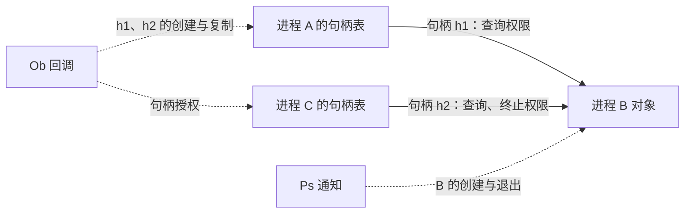
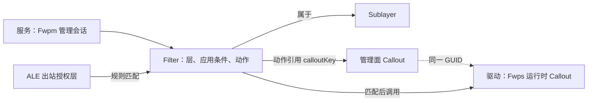
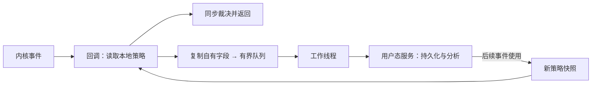

# 概念

EDR 驱动通过 Windows 公开扩展点采集行为，并在接口允许的阶段控制操作。本文以 Windows 11 x64 为示例环境，串起 Ps、Ob、Cm、Minifilter 和 WFP 的注册、处理与退出。

## Hook、通知与过滤框架

狭义 Hook 修改已有执行路径；受支持的回调由子系统主动调用；过滤框架进一步管理排序、请求完成与资源生命周期。本文讨论后两类机制，不涉及内核补丁或未公开结构。

| 机制 | 事件对象 | 控制入口 |
|---|---|---|
| Ps 通知 | 进程、线程、镜像 | 进程 Ex 通知可否决创建；线程、镜像通知用于观测。 |
| Ob 回调 | 支持对象的句柄创建、复制 | Pre 裁剪允许修改的访问权限。 |
| Cm 回调 | 注册表操作 | Pre 拒绝或接管；Post 按契约处理结果。 |
| Minifilter | 文件系统 I/O | 继续下发、完成或在支持路径挂起请求。 |
| WFP | 连接授权、流、数据包 | Filter 匹配规则；Callout 执行自定义分类。 |

## 对象、句柄与授权

进程对象表示内核中的进程；句柄属于某个句柄表，引用对象并携带访问权限。Ps 描述对象生命周期，Ob 参与句柄授权；随后使用已有句柄的操作通常不再触发一次 Ob 授权。



# 开发环境

使用与目标系统配套的 Visual Studio、SDK 和 WDK；签名、代码完整性及过滤实例配置决定驱动能否加载。实验在可恢复的独立虚拟机中进行。[WDK 下载与工具版本](https://learn.microsoft.com/en-us/windows-hardware/drivers/download-the-wdk)

下列代码是按公开接口编写的模块片段，未编译、未加载、未运行。省略工程文件、INF、设备创建、通信和事件队列；核心判断及必要清理均在代码内。每个 Start/Stop 由生命周期协调者在 `PASSIVE_LEVEL` 串行调用，同一模块只注册一次；传入的配置已经校验，字符串及上下文在注销完成前保持有效、不可变且驻留内存。

# 项目结构

以下是示意职责划分，片段分别放入对应文件；没有在本机创建或安装这些驱动模块。

```text
EdrLab/
├─ driver/
│  ├─ entry.c        # 模块初始化、失败回滚与统一退出
│  ├─ process.c      # Ps 创建裁决
│  ├─ object.c       # Ob 句柄授权
│  ├─ registry.c     # Cm 注册表过滤
│  ├─ file.c         # Minifilter
│  ├─ network.c      # WFP 运行时
│  └─ EdrLab.inf     # 签名安装与文件过滤实例配置
├─ service/
│  ├─ main.c         # 配置、事件消费与持久化
│  └─ wfp_policy.c   # WFP 管理对象
└─ shared/
   └─ protocol.h     # 双方约定的消息、GUID 与策略值
```

# 进程、线程与镜像通知

三类通知分别描述进程生命周期、线程生命周期和镜像映射。以下以进程 Ex 通知展示裁决链；线程与镜像的观测差异随后比较。

## 进程创建裁决

调用方传入与通知使用相同名称空间的完整映像路径；例子只拒绝该路径，名称不可用时放行。

```c
#include <ntddk.h>

static UNICODE_STRING gDeniedImage;
static BOOLEAN gProcessRegistered;

static VOID ProcessNotify(
    PEPROCESS Process, HANDLE ProcessId, PPS_CREATE_NOTIFY_INFO Info)
{
    UNREFERENCED_PARAMETER(Process);   // 正在创建或退出的目标对象
    UNREFERENCED_PARAMETER(ProcessId); // 目标 PID，不是创建者 PID
    if (Info == NULL)
        return;                      // 退出通知：没有创建信息可读取

    // ParentProcessId 是父进程；CreatingThreadId 是实际创建者。
    // CommandLine、ImageFileName 均可能为空，不能直接保留借用指针。
    if (NT_SUCCESS(Info->CreationStatus) && // 保留其他组件已有的失败
        Info->FileOpenNameAvailable &&
        Info->ImageFileName != NULL &&
        RtlEqualUnicodeString(Info->ImageFileName, &gDeniedImage, TRUE)) {
        Info->CreationStatus = STATUS_ACCESS_DENIED;
    }
    // 回调返回 VOID；否决通过 CreationStatus 生效。
}

NTSTATUS StartProcessNotify(PCUNICODE_STRING ExactImagePath)
{
    NTSTATUS status;
    gDeniedImage = *ExactImagePath; // 借用配置缓冲区，须活到成功注销之后
    status = PsSetCreateProcessNotifyRoutineEx(ProcessNotify, FALSE);
    gProcessRegistered = NT_SUCCESS(status);
    return status;                 // 含签名/完整性、重复注册、容量等失败
}

NTSTATUS StopProcessNotify(VOID)
{
    NTSTATUS status;
    if (!gProcessRegistered)
        return STATUS_SUCCESS;
    // 必须从自身回调之外调用；返回前等待在途回调结束。
    status = PsSetCreateProcessNotifyRoutineEx(ProcessNotify, TRUE);
    if (NT_SUCCESS(status))
        gProcessRegistered = FALSE;
    return status;                 // 失败时保留配置和代码，不能继续卸载
}
```

Ex 注册要求映像具有 `IMAGE_DLLCHARACTERISTICS_FORCE_INTEGRITY`；`/INTEGRITYCHECK` 与此相关，系统签名要求仍需满足。传统进程通知没有创建状态字段；Ex2 可扩展至子系统进程，其文件对象、名称和命令行可能为空。[注册与注销](https://learn.microsoft.com/en-us/windows-hardware/drivers/ddi/ntddk/nf-ntddk-pssetcreateprocessnotifyroutineex)、[创建信息](https://learn.microsoft.com/en-us/windows-hardware/drivers/ddi/ntddk/ns-ntddk-_ps_create_notify_info)

## 线程与镜像观测

| 通知 | 参数与时机 | 生命周期与覆盖 |
|---|---|---|
| `PsSetCreateThreadNotifyRoutine` | `ProcessId`、`ThreadId`、`Create`；创建为真，删除为假；返回 `VOID`。 | `PsRemoveCreateThreadNotifyRoutine` 注销；参数本身不提供创建否决或恶意性判断。 |
| `PsSetLoadImageNotifyRoutine` | 映像映射后、入口点执行前；`ImageBase`、`ImageSize` 位于 `IMAGE_INFO`；名称可能为空，驱动映像的 PID 为零。 | `PsRemoveLoadImageNotifyRoutine` 注销；返回 `VOID`，没有失败返回式阻断，也没有对应的通用卸载通知。 |

线程 Ex 的通知模式会影响回调线程上下文；镜像 Ex 的标志可扩展跨体系结构覆盖。镜像事件不覆盖全部可执行内存修改，`SEC_IMAGE_NO_EXECUTE` 映射也不触发普通加载通知。[线程回调](https://learn.microsoft.com/en-us/windows-hardware/drivers/ddi/ntddk/nc-ntddk-pcreate_thread_notify_routine)、[镜像回调](https://learn.microsoft.com/en-us/windows-hardware/drivers/ddi/ntddk/nc-ntddk-pload_image_notify_routine)

# 对象句柄过滤

Ob 回调支持进程 `PsProcessType`、线程 `PsThreadType`，以及 Windows 10 起的桌面 `ExDesktopObjectType`。它参与句柄创建与复制；文件、令牌和注册表键使用各自接口。

## 进程句柄授权

下面只裁剪指定进程的用户句柄。调用方提供有效的目标进程对象和合法 Altitude；`OB_STATE` 放在调用方持有的驻留存储中，Stop 完成前不能释放。

```c
#include <ntifs.h>

typedef struct {
    PEPROCESS Target;
    PVOID Registration;
    volatile LONG LastGrantedAccess; // 最近一次成功完成的目标句柄权限
} OB_STATE;

static OB_PREOP_CALLBACK_STATUS ObjectPre(
    PVOID Context, POB_PRE_OPERATION_INFORMATION Info)
{
    OB_STATE *s = Context;
    ACCESS_MASK *desired;

    if (Info->ObjectType != *PsProcessType ||
        Info->Object != s->Target || Info->KernelHandle)
        return OB_PREOP_SUCCESS;    // 此例不限制内核句柄

    switch (Info->Operation) {
    case OB_OPERATION_HANDLE_CREATE:
        desired = &Info->Parameters->CreateHandleInformation.DesiredAccess;
        break;
    case OB_OPERATION_HANDLE_DUPLICATE:
        desired = &Info->Parameters->DuplicateHandleInformation.DesiredAccess;
        // SourceProcess/TargetProcess 是两个句柄表所属进程；
        // 真正被访问的进程仍是 Info->Object。
        break;
    default:
        return OB_PREOP_SUCCESS;
    }

    // OriginalDesiredAccess 保留原始请求，DesiredAccess 是当前待授予权限。
    // 只在当前值清除文档允许修改的位，保留其他过滤器已做的限制。
    *desired &= ~(PROCESS_TERMINATE | PROCESS_CREATE_THREAD |
                  PROCESS_VM_OPERATION | PROCESS_VM_WRITE);
    Info->CallContext = s;          // 只作本次已处理标记，不存可变每操作数据
    return OB_PREOP_SUCCESS;        // 状态不用于否决；可能获得权限更少的句柄
}

static VOID ObjectPost(PVOID Context, POB_POST_OPERATION_INFORMATION Info)
{
    OB_STATE *s = Context;
    ACCESS_MASK granted;
    if (Info->CallContext != s || !NT_SUCCESS(Info->ReturnStatus))
        return;                    // 失败时 Parameters 不保证有效

    switch (Info->Operation) {
    case OB_OPERATION_HANDLE_CREATE:
        granted = Info->Parameters->CreateHandleInformation.GrantedAccess;
        break;
    case OB_OPERATION_HANDLE_DUPLICATE:
        granted = Info->Parameters->DuplicateHandleInformation.GrantedAccess;
        break;
    default:
        return;
    }
    InterlockedExchange(&s->LastGrantedAccess, (LONG)granted);
    // Post 只读结果；不会在这里重新修改授权。
}

NTSTATUS StartObjectFilter(
    OB_STATE *s, PEPROCESS Target, PCUNICODE_STRING Altitude)
{
    struct {
        OB_CALLBACK_REGISTRATION Registration;
        OB_OPERATION_REGISTRATION Operation;
    } r = {0};
    NTSTATUS status;
    RtlZeroMemory(s, sizeof(*s));
    ObReferenceObject(Target);       // 调用方已有有效引用；本模块再持有一份
    s->Target = Target;

    r.Operation.ObjectType = PsProcessType; // 注册处为 POBJECT_TYPE*
    r.Operation.Operations =
        OB_OPERATION_HANDLE_CREATE | OB_OPERATION_HANDLE_DUPLICATE;
    r.Operation.PreOperation = ObjectPre;
    r.Operation.PostOperation = ObjectPost;
    r.Registration.Version = OB_FLT_REGISTRATION_VERSION;
    r.Registration.OperationRegistrationCount = 1;
    r.Registration.Altitude = *Altitude;    // 不内置可供生产使用的高度
    r.Registration.RegistrationContext = s;
    r.Registration.OperationRegistration = &r.Operation;

    status = ObRegisterCallbacks(&r.Registration, &s->Registration);
    if (!NT_SUCCESS(status)) {
        s->Registration = NULL;
        ObDereferenceObject(s->Target);
        s->Target = NULL;
    }
    return status;
}

VOID StopObjectFilter(OB_STATE *s)
{
    if (s->Registration == NULL)
        return;
    ObUnRegisterCallbacks(s->Registration);
    s->Registration = NULL;
    ObDereferenceObject(s->Target);   // 先注销，再释放回调引用的对象
    s->Target = NULL;
}
```

可修改权限以结构文档的清单为准，其中不包含 `PROCESS_VM_READ`。注册高度冲突和未签名内核映像均可使注册失败。[权限约束](https://learn.microsoft.com/en-us/windows-hardware/drivers/ddi/wdm/ns-wdm-_ob_pre_create_handle_information)、[注册结构](https://learn.microsoft.com/en-us/windows-hardware/drivers/ddi/wdm/ns-wdm-_ob_callback_registration)、[注册失败](https://learn.microsoft.com/en-us/windows-hardware/drivers/ddi/wdm/nf-wdm-obregistercallbacks)、[Post 结果](https://learn.microsoft.com/en-us/windows-hardware/drivers/ddi/wdm/ns-wdm-_ob_post_operation_information)

新建一个指向既有进程的句柄不会重新创建进程；已有句柄上的授权也不会被新注册的 Ob 策略追溯撤销。线程句柄需要独立注册 `PsThreadType` 并使用线程权限集合；这个进程示例只覆盖新进程句柄授权。

# 注册表过滤

Configuration Manager 用一个回调入口分派注册表通知；`Argument1` 决定 `Argument2` 的结构类型。以下示例按完整内核键名，拒绝设置值、删除值、删除键和重命名键；名称查询失败时放行。

## 键操作分派

调用方提供合法 Altitude 和驻留的 `CM_STATE`。此例固定保护 `\REGISTRY\MACHINE\SOFTWARE\EdrLab`，对应 `HKLM\SOFTWARE\EdrLab`，不递归匹配子键。

```c
#include <ntifs.h>

typedef struct {
    LARGE_INTEGER Cookie;
    volatile LONG Ready;           // 注册成功后才允许读取 Cookie
    volatile LONG Completed;
    BOOLEAN Registered;
} CM_STATE;

static BOOLEAN IsProtectedKey(CM_STATE *s, PVOID Object)
{
    const UNICODE_STRING protectedName =
        RTL_CONSTANT_STRING(L"\\REGISTRY\\MACHINE\\SOFTWARE\\EdrLab");
    PCUNICODE_STRING name;
    BOOLEAN match;
    NTSTATUS status = CmCallbackGetKeyObjectIDEx(
        &s->Cookie, Object, NULL, &name, 0);
    if (!NT_SUCCESS(status))
        return FALSE;              // 此例明确采用查询失败放行

    match = RtlEqualUnicodeString(name, &protectedName, TRUE);
    CmCallbackReleaseKeyObjectIDEx(name); // 名称所有权在本次回调内闭合
    return match;
}

static NTSTATUS RegistryNotify(PVOID Context, PVOID Argument1, PVOID Argument2)
{
    CM_STATE *s = Context;          // 来自 CmRegisterCallbackEx 的 Context
    PVOID object;
    REG_NOTIFY_CLASS kind = (REG_NOTIFY_CLASS)(ULONG_PTR)Argument1;

    if (InterlockedCompareExchange(&s->Ready, 0, 0) == 0)
        return STATUS_SUCCESS;     // 初始化窗口放行；不读取未发布的 Cookie

    switch (kind) {
    case RegNtPreSetValueKey:
        object = ((PREG_SET_VALUE_KEY_INFORMATION)Argument2)->Object;
        // ValueName、Type、Data、DataSize 描述待写值；本策略只判断键。
        break;
    case RegNtPreDeleteValueKey:
        object = ((PREG_DELETE_VALUE_KEY_INFORMATION)Argument2)->Object;
        break;
    case RegNtPreDeleteKey:
        object = ((PREG_DELETE_KEY_INFORMATION)Argument2)->Object;
        break;
    case RegNtPreRenameKey:
        object = ((PREG_RENAME_KEY_INFORMATION)Argument2)->Object;
        break;
    case RegNtPostSetValueKey:
    case RegNtPostDeleteValueKey:
    case RegNtPostDeleteKey:
    case RegNtPostRenameKey: {
        PREG_POST_OPERATION_INFORMATION post = Argument2;
        if (NT_SUCCESS(post->Status))
            InterlockedIncrement(&s->Completed); // 只统计已完成操作
        return STATUS_SUCCESS;     // 保留系统结果，不解引用 Post 的 Object
    }
    default:
        return STATUS_SUCCESS;     // 其他类型不参与，不能套用上述结构
    }

    if (!IsProtectedKey(s, object))
        return STATUS_SUCCESS;
    return STATUS_ACCESS_DENIED;    // 不执行原操作；自己拒绝后没有对应 Post
}

NTSTATUS StartRegistryFilter(
    CM_STATE *s, PDRIVER_OBJECT Driver, PCUNICODE_STRING Altitude)
{
    NTSTATUS status;
    RtlZeroMemory(s, sizeof(*s));
    status = CmRegisterCallbackEx(
        RegistryNotify, Altitude, Driver, s, &s->Cookie, NULL);
    if (NT_SUCCESS(status)) {
        s->Registered = TRUE;
        InterlockedExchange(&s->Ready, 1); // 发布成功返回的 Cookie
    }
    return status;
}

NTSTATUS StopRegistryFilter(CM_STATE *s)
{
    NTSTATUS status;
    if (!s->Registered)
        return STATUS_SUCCESS;
    // 在回调之外注销；保持 s 有效，直到注销成功。
    status = CmUnRegisterCallback(s->Cookie);
    if (NT_SUCCESS(status)) {
        s->Registered = FALSE;
        InterlockedExchange(&s->Ready, 0);
    }
    return status;
}
```

注册、枚举对应的参数类型及名称释放依据：[CmRegisterCallbackEx](https://learn.microsoft.com/en-us/windows-hardware/drivers/ddi/wdm/nf-wdm-cmregistercallbackex)、[RegistryCallback](https://learn.microsoft.com/en-us/windows-hardware/drivers/ddi/wdm/nc-wdm-ex_callback_function)、[键名称查询](https://learn.microsoft.com/en-us/windows-hardware/drivers/ddi/wdm/nf-wdm-cmcallbackgetkeyobjectidex)。Ex 名称接口要求 Windows 8 起的系统。

## 输出接管与对象有效期

Pre 返回 `STATUS_CALLBACK_BYPASS` 表示已经接管并完成操作，须提供有效输出，也没有对应 Post。Post 改变调用方所见状态时，应设置 `ReturnStatus` 并返回 `STATUS_CALLBACK_BYPASS`；成功改失败需处理已生成资源，失败改成功需补齐有效输出。仅观察结果时返回 `STATUS_SUCCESS`。[通知处理契约](https://learn.microsoft.com/en-us/windows-hardware/drivers/kernel/handling-notifications)

`RegNtPostCreateKeyEx`、`RegNtPostOpenKeyEx` 仅在 `Status == STATUS_SUCCESS` 时拥有有效 `Object`，单用 `NT_SUCCESS` 不够。关闭、对象上下文清理通知可能携带正在销毁的对象，不能仅凭非空就增加引用。[无效键对象指针](https://learn.microsoft.com/en-us/windows-hardware/drivers/kernel/invalid-key-object-pointers-in-registry-notifications)

`CallContext` 跟随一次操作，`CmSetCallbackObjectContext` 关联键对象并产生对象上下文清理通知。嵌套数据须按对应通知的访问规则读取；跨回调保存需复制或合法持有，回调内再次调用注册表 API 还需处理重入。上述例子未读取值数据、分配操作上下文或发起嵌套注册表操作。

# 文件系统过滤

Minifilter 由 `FltMgr.sys` 管理。Filter 表示已注册驱动，Instance 表示附加到某个卷的实例，Altitude 决定实例在文件过滤栈中的相对位置；Pre 向下，Post 沿完成路径向上。

## 文件过滤接入

此例在 DriverEntry 初始化路径中调用 `StartFileFilter`，以完整规范化路径限制新建/打开请求。INF 必须已配置合法实例及 Altitude，目标卷必须附加实例。

```c
#include <fltKernel.h>

static PFLT_FILTER gFilter;
static UNICODE_STRING gDeniedFile;

static FLT_PREOP_CALLBACK_STATUS FLTAPI PreCreate(
    PFLT_CALLBACK_DATA Data, PCFLT_RELATED_OBJECTS Objects,
    PVOID *CompletionContext)
{
    PFLT_FILE_NAME_INFORMATION name;
    BOOLEAN deny;
    NTSTATUS status;
    UNREFERENCED_PARAMETER(Objects);
    *CompletionContext = NULL;      // 本例既不挂起，也不申请 Post

    status = FltGetFileNameInformation(
        Data, FLT_FILE_NAME_NORMALIZED | FLT_FILE_NAME_QUERY_DEFAULT, &name);
    if (!NT_SUCCESS(status))
        return FLT_PREOP_SUCCESS_NO_CALLBACK; // 名称查询失败时放行

    deny = RtlEqualUnicodeString(&name->Name, &gDeniedFile, TRUE);
    FltReleaseFileNameInformation(name);
    if (!deny)
        return FLT_PREOP_SUCCESS_NO_CALLBACK;

    Data->IoStatus.Status = STATUS_ACCESS_DENIED;
    Data->IoStatus.Information = 0;
    return FLT_PREOP_COMPLETE;      // 不下发；本过滤器也不会收到 Post
    // 只改 IoStatus 不必调用 FltSetCallbackDataDirty。
}

VOID StopFileFilter(VOID)
{
    if (gFilter != NULL) {
        FltUnregisterFilter(gFilter);
        gFilter = NULL;
    }
}

static NTSTATUS FLTAPI FileUnload(FLT_FILTER_UNLOAD_FLAGS Flags)
{
    UNREFERENCED_PARAMETER(Flags);
    StopFileFilter();               // 此片段没有自有队列、端口或挂起请求
    return STATUS_SUCCESS;
}

static const FLT_OPERATION_REGISTRATION gFileOperations[] = {
    { IRP_MJ_CREATE, 0, PreCreate, NULL, NULL },
    { IRP_MJ_OPERATION_END, 0, NULL, NULL, NULL }
};
static FLT_REGISTRATION gFileRegistration; // 保留描述存储到卸载

NTSTATUS StartFileFilter(PDRIVER_OBJECT Driver, PCUNICODE_STRING NormalizedPath)
{
    NTSTATUS status;
    gDeniedFile = *NormalizedPath;  // 所有回调依赖数据必须在启动前就绪
    gFileRegistration.Size = sizeof(gFileRegistration);
    gFileRegistration.Version = FLT_REGISTRATION_VERSION;
    gFileRegistration.OperationRegistration = gFileOperations;
    gFileRegistration.FilterUnloadCallback = FileUnload;

    status = FltRegisterFilter(Driver, &gFileRegistration, &gFilter);
    if (!NT_SUCCESS(status)) {
        gFilter = NULL;
        return status;
    }
    status = FltStartFiltering(gFilter); // 返回前就可能执行回调
    if (!NT_SUCCESS(status))
        StopFileFilter();           // 注册成功、启动失败的回滚
    return status;
}
```

完成状态必须是最终值，不能为 `STATUS_PENDING`；Cleanup/Close 不能失败。更高层过滤器仍可收到该请求的 Post。规范化名称查询受 I/O 路径和执行上下文限制，查询失败放行是本例覆盖选择。[Pre 返回契约](https://learn.microsoft.com/en-us/windows-hardware/drivers/ddi/fltkernel/nc-fltkernel-pflt_pre_operation_callback)、[名称查询](https://learn.microsoft.com/en-us/windows-hardware/drivers/ddi/fltkernel/nf-fltkernel-fltgetfilenameinformation)、[注册](https://learn.microsoft.com/en-us/windows-hardware/drivers/ddi/fltkernel/nf-fltkernel-fltregisterfilter)、[启动](https://learn.microsoft.com/en-us/windows-hardware/drivers/ddi/fltkernel/nf-fltkernel-fltstartfiltering)

## I/O 覆盖与完成责任

`IRP_MJ_CREATE` 控制新打开；读写需注册 `IRP_MJ_READ/WRITE`，重命名和删除处置涉及 `IRP_MJ_SET_INFORMATION`。已有句柄、映射、缓存、分页及路径别名需按保护对象单独设计；在 Post 改返回状态不会自动撤销文件系统副作用。

需要 Post 时注册完成回调并返回 `FLT_PREOP_SUCCESS_WITH_CALLBACK`；`CompletionContext` 用于传递该次操作的数据。Post 收到 `FLTFL_POST_OPERATION_DRAINING` 时只清理完成上下文并按框架规则退出。[Post 契约](https://learn.microsoft.com/en-us/windows-hardware/drivers/ddi/fltkernel/nc-fltkernel-pflt_post_operation_callback)

`FLT_PREOP_PENDING` 只用于支持的 IRP 路径，后续须调用 `FltCompletePendedPreOperation`。正常裁决、超时、取消和卸载必须争取同一个完成权，保证每个请求只完成一次；`FLT_PREOP_DISALLOW_FASTIO` 仅拒绝 Fast I/O 路径，后续可能改走 IRP。[挂起与完成](https://learn.microsoft.com/en-us/windows-hardware/drivers/ddi/fltkernel/nf-fltkernel-fltcompletependedpreoperation)

# 网络过滤

WFP 的 Layer 决定处理阶段与可用数据，Sublayer 参与规则排序，Filter 指定条件和动作，Callout 提供自定义处理。固定条件可直接使用阻断 Filter；下例增加 Callout，用于展示管理面与运行时的连接。



## 运行时与应用规则

`network.c` 的入口由驱动传入已创建的设备对象和项目自己的 Callout GUID。`FWPS_CALLOUT0` 使用六参数分类函数；`Filter->context` 来自下一块管理代码的 `rawContext`，这里用数值 1 表示拒绝。

```c
#include <ntddk.h>
#include <fwpsk.h>

static VOID NTAPI ConnectClassify(
    const FWPS_INCOMING_VALUES0 *Values,
    const FWPS_INCOMING_METADATA_VALUES0 *Meta, VOID *LayerData,
    const FWPS_FILTER0 *Filter, UINT64 FlowContext, FWPS_CLASSIFY_OUT0 *Out)
{
    UNREFERENCED_PARAMETER(Values);
    UNREFERENCED_PARAMETER(Meta);
    UNREFERENCED_PARAMETER(LayerData);
    UNREFERENCED_PARAMETER(FlowContext); // 本例不关联流上下文

    if ((Out->rights & FWPS_RIGHT_ACTION_WRITE) == 0)
        return;                    // 本例不走无写权限时的 Permit veto 路径

    if (Filter->context == 1) {
        Out->actionType = FWP_ACTION_BLOCK;
        Out->rights &= ~FWPS_RIGHT_ACTION_WRITE;
    } else {
        Out->actionType = FWP_ACTION_CONTINUE; // 继续仲裁，不承诺最终放行
    }
}

static NTSTATUS NTAPI ConnectNotify(
    FWPS_CALLOUT_NOTIFY_TYPE Type, const GUID *FilterKey,
    FWPS_FILTER0 *Filter)
{
    UNREFERENCED_PARAMETER(Type);
    UNREFERENCED_PARAMETER(FilterKey);
    UNREFERENCED_PARAMETER(Filter);
    return STATUS_SUCCESS;         // 添加/删除规则无需额外私有资源
}

NTSTATUS StartConnectCallout(
    PDEVICE_OBJECT Device, const GUID *Key, UINT32 *RuntimeId)
{
    FWPS_CALLOUT0 callout = {0};
    callout.calloutKey = *Key;
    callout.classifyFn = ConnectClassify;
    callout.notifyFn = ConnectNotify;
    // flowDeleteFn 为 NULL：没有 FwpsFlowAssociateContext0 创建的上下文。
    return FwpsCalloutRegister0(Device, &callout, RuntimeId);
}

NTSTATUS StopConnectCallout(UINT32 RuntimeId)
{
    // 仅在成功注册后调用；管理面先撤销引用此 Callout 的规则。
    return FwpsCalloutUnregisterById0(RuntimeId);
    // 调用方必须检查结果：注销失败时不能释放设备或卸载驱动。
}
```

运行时注册本身不创建匹配规则；结构、函数版本后缀必须成套使用。[运行时注册](https://learn.microsoft.com/en-us/windows-hardware/drivers/ddi/fwpsk/nf-fwpsk-fwpscalloutregister0)、[六参数分类签名](https://learn.microsoft.com/en-us/windows-hardware/drivers/ddi/fwpsk/nc-fwpsk-fwps_callout_classify_fn0)、[通知签名](https://learn.microsoft.com/en-us/windows-hardware/drivers/ddi/fwpsk/nc-fwpsk-fwps_callout_notify_fn0)

`service/wfp_policy.c` 在运行时注册成功后调用以下 Win32 C 入口：传入目标程序的完整路径、与驱动一致的 Callout GUID、自有 Sublayer GUID 和选定权重。成功后保留 `Engine`，策略才持续有效。

```c
#include <windows.h>
#include <initguid.h>               // 本翻译单元实例化后续 WFP GUID 常量
#include <fwpmu.h>
#pragma comment(lib, "Fwpuclnt.lib")

DWORD StartConnectRule(
    PCWSTR AppPath, const GUID *CalloutKey, const GUID *SublayerKey,
    UINT16 SublayerWeight, HANDLE *Engine)
{
    FWPM_SESSION0 session = {0};
    FWPM_SUBLAYER0 sublayer = {0};
    FWPM_CALLOUT0 callout = {0};
    FWPM_FILTER_CONDITION0 condition = {0};
    FWPM_FILTER0 filter = {0};
    FWP_BYTE_BLOB *appId = NULL;
    HANDLE engine = NULL;
    WCHAR name[] = L"EdrLab application rule";
    DWORD error, closeError;
    *Engine = NULL;

    session.flags = FWPM_SESSION_FLAG_DYNAMIC;
    error = FwpmEngineOpen0(NULL, RPC_C_AUTHN_WINNT, NULL, &session, &engine);
    if (error != ERROR_SUCCESS)
        return error;               // 用户态返回 DWORD，不使用 NT_SUCCESS

    error = FwpmGetAppIdFromFileName0(AppPath, &appId);
    if (error != ERROR_SUCCESS)
        goto failed;

    sublayer.subLayerKey = *SublayerKey;
    sublayer.displayData.name = name;
    sublayer.weight = SublayerWeight;
    callout.calloutKey = *CalloutKey;
    callout.displayData.name = name;
    callout.applicableLayer = FWPM_LAYER_ALE_AUTH_CONNECT_V4;

    condition.fieldKey = FWPM_CONDITION_ALE_APP_ID;
    condition.matchType = FWP_MATCH_EQUAL;
    condition.conditionValue.type = FWP_BYTE_BLOB_TYPE;
    condition.conditionValue.byteBlob = appId;
    filter.displayData.name = name;
    filter.layerKey = callout.applicableLayer;
    filter.subLayerKey = *SublayerKey;
    filter.weight.type = FWP_EMPTY; // 由引擎分配过滤器权重
    filter.numFilterConditions = 1;
    filter.filterCondition = &condition;
    filter.action.type = FWP_ACTION_CALLOUT_UNKNOWN; // 支持 BLOCK / CONTINUE
    filter.action.calloutKey = *CalloutKey;
    filter.rawContext = 1;          // 原样传给驱动的 Filter->context

    error = FwpmTransactionBegin0(engine, 0);
    if (error != ERROR_SUCCESS)
        goto failed;
    error = FwpmSubLayerAdd0(engine, &sublayer, NULL);
    if (error != ERROR_SUCCESS)
        goto rollback;
    error = FwpmCalloutAdd0(engine, &callout, NULL, NULL);
    if (error != ERROR_SUCCESS)
        goto rollback;
    error = FwpmFilterAdd0(engine, &filter, NULL, NULL);
    if (error != ERROR_SUCCESS)
        goto rollback;
    error = FwpmTransactionCommit0(engine);
    if (error != ERROR_SUCCESS)
        goto rollback;

    FwpmFreeMemory0((void **)&appId); // 添加接口已消费输入
    *Engine = engine;               // 会话所有权交给调用方
    return ERROR_SUCCESS;

rollback:
    FwpmTransactionAbort0(engine);
failed:
    if (appId != NULL)
        FwpmFreeMemory0((void **)&appId);
    closeError = FwpmEngineClose0(engine); // 动态对象随会话清理
    if (closeError != ERROR_SUCCESS)
        *Engine = engine;           // 清理失败也交还句柄，由调用方重试关闭
    return error;
}

DWORD StopConnectRule(HANDLE *Engine)
{
    DWORD error = FwpmEngineClose0(*Engine); // 成功建立会话后调用
    if (error == ERROR_SUCCESS)
        *Engine = NULL;
    return error;                   // 成功后再协调驱动注销运行时 Callout
}
```

应用标识的分配与释放、动态会话、上下文与动作依据：[应用标识](https://learn.microsoft.com/en-us/windows/win32/api/fwpmu/nf-fwpmu-fwpmgetappidfromfilename0)、[会话生命周期](https://learn.microsoft.com/en-us/windows/win32/api/fwpmu/nf-fwpmu-fwpmengineopen0)、[Filter 与 rawContext](https://learn.microsoft.com/en-us/windows/win32/api/fwpmtypes/ns-fwpmtypes-fwpm_filter0)、[Callout 动作类型](https://learn.microsoft.com/en-us/windows/win32/api/fwpstypes/ns-fwpstypes-fwps_action0)。生产服务还需处理 BFE 重启、清理失败与规则重建。

## 过滤层与撤销边界

| 层 | 关注内容 |
|---|---|
| `ALE_AUTH_CONNECT_V4/V6` | 出站授权 |
| `ALE_AUTH_RECV_ACCEPT_V4/V6` | 入站接收或连接接受授权 |
| `ALE_FLOW_ESTABLISHED_V4/V6` | 已建立流的关联 |
| `STREAM_V4/V6` | TCP 数据流 |
| `DATAGRAM_DATA_V4/V6` | 数据报处理 |
| Transport / IP Packet | 传输层或 IP 包处理 |

例子只覆盖目标应用的 IPv4 出站授权。IPv6、已有连接、重新授权与流检查需分别设计；`layerData` 的类型随层变化。读取进程 ID 前必须检查 `FWPS_METADATA_FIELD_PROCESS_ID` 是否存在，当前分类线程不一定属于发起应用。[过滤层](https://learn.microsoft.com/en-us/windows/win32/fwp/management-filtering-layer-identifiers-)

撤销动态会话只删除管理对象，仍需注销运行时 Callout。遗留 `CALLOUT_TERMINATING/UNKNOWN` Filter 在 Callout 未注册时通常按阻断处理；存在关联流上下文时注销可能返回 `STATUS_DEVICE_BUSY`，必须先移除上下文并完成注销才能卸载。[注销约束](https://learn.microsoft.com/en-us/windows-hardware/drivers/ddi/fwpsk/nf-fwpsk-fwpscalloutunregisterbyid0)

# 其他内核通知

这些接口辅助所属子系统的生命周期管理，不承担五类主机制的全部职责。

| 接口 | 事件对象 | 对应退出方式或边界 |
|---|---|---|
| `ExRegisterCallback` | 回调对象 | `ExUnregisterCallback` |
| `IoRegisterPlugPlayNotification` | 即插即用事件 | `IoUnregisterPlugPlayNotificationEx` |
| `IoRegisterFsRegistrationChange` | 文件系统注册状态 | `IoUnregisterFsRegistrationChange` |
| `PoRegisterPowerSettingCallback` | 电源设置变化 | `PoUnregisterPowerSettingCallback` |
| `SeRegisterLogonSessionTerminatedRoutine` | 登录会话终止 | `SeUnregisterLogonSessionTerminatedRoutine`；最后一个关联令牌引用消失后触发。 |
| `IoRegisterShutdownNotification` | 设备关机请求 | `IoUnregisterShutdownNotification`；处理 `IRP_MJ_SHUTDOWN`。 |
| `KeRegisterBugCheckReasonCallback` | 系统崩溃阶段 | `KeDeregisterBugCheckReasonCallback`；严格受限的崩溃上下文。 |

# 回调执行与驱动生命周期

## 执行上下文与事件上报

IRQL 与线程上下文决定可用内存、锁和 API；注册函数与回调函数的执行约束需分别核对。

| 回调 | 主要约束 |
|---|---|
| 进程 Ex、Ob Pre/Post | `PASSIVE_LEVEL`，普通内核 APC 被禁用。 |
| 普通线程通知、Cm | 不高于 `APC_LEVEL`。 |
| 镜像加载 | `PASSIVE_LEVEL`，临界区及 APC 约束。 |
| Minifilter Pre/Post | 依 I/O 路径；Post 可到 `DISPATCH_LEVEL`。 |
| WFP classify | 可到 `DISPATCH_LEVEL`，受层和数据类型限制。 |

`PASSIVE_LEVEL` 不保证可以任意阻塞；Ps/Ob 回调应及时返回，避免等待用户态服务或其他工作线程。事件归因使用接口提供的目标与请求者语义。[驱动回调最佳实践](https://learn.microsoft.com/en-us/windows-hardware/drivers/kernel/windows-kernel-mode-process-and-thread-manager)



队列必须持有自有数据；对象引用遵守对应框架规则。消息应区分目标身份、实际执行上下文、原始请求、裁决、策略版本及字段缺失原因；队列满时按预定策略丢弃或降级并计数。服务稍后的判断无法追溯改写已返回的 Ps/Ob 裁决。

## 初始化与统一退出

先准备共享状态，再注册模块，最后开放控制入口；只回滚已经成功的注册。各代码块的 Stop 是模块级清理，组合工程需要由同一个生命周期协调者调用，并把 Minifilter 卸载回调接入该退出路径。

退出时阻止新控制请求和自有任务，按框架依赖完成挂起请求、注销来源、等待回调与工作项，再释放配置、对象引用、队列和设备。注销回调不会替驱动排空自建队列；注销失败也不能继续释放驱动代码。Ps/Cm 注销必须在自身回调之外进行。[Cm 注销](https://learn.microsoft.com/en-us/windows-hardware/drivers/ddi/wdm/nf-wdm-cmunregistercallback)

## 用户态通信

设备控制接口与 Minifilter 通信端口需检查调用权限、长度、对象范围和状态；接口不应暴露通用内核地址读写或任意函数调用。服务断开、重启及策略更新失败时，执行预先定义的本地失败策略，避免无限期等待服务。

# 运行与验证

以下是测试设计及待执行命令，未在本机安装、运行或加载驱动。

## 实验路径

在测试虚拟机补齐工程、签名、INF 和控制入口后，先建立放行基线，再依次启用 Ps 路径拒绝、Ob 目标保护、Cm 测试键、文件路径规则及 WFP 应用规则。

| 测试对象 | 核心断言 |
|---|---|
| 新进程及退出 | 创建者与父进程分开记录；Ex 拒绝使创建失败。 |
| 新建、复制与已有进程句柄 | 核对实际授权和被移除权限对应操作；已有句柄单独验证。 |
| 测试键的四类写操作 | 拒绝后无该次修改；本过滤器拒绝的操作没有对应 Post。 |
| 目标文件与目标卷 | Instance 已附加；Create 拒绝与名称查询失败放行分别验证。 |
| 目标应用的网络请求 | IPv4、IPv6及已有连接分别测试；动态会话撤销后无遗留规则。 |
| 注册失败、并发与反复退出 | 已成功资源回滚；无重复完成、泄漏或注销失败后卸载。 |

## 实例、规则与驱动检查

只在已部署实验驱动的测试虚拟机中执行：

```powershell
# Filter 注册与目标卷 Instance 附加是两个检查点。
fltmc filters
fltmc instances
fltmc volumes

# 核对层、子层、Callout GUID 和应用条件。
netsh wfp show state file=wfpstate.xml

# Verifier 会主动暴露驱动错误，可能触发蓝屏；仅针对自己的实验驱动。
verifier /standard /driver EdrLab.sys
# 按要求重启并执行测试后检查配置。
verifier /querysettings
# 实验结束清除配置，随后重启。
verifier /reset
```

命令与实验准备依据：[Minifilter 开发与测试](https://learn.microsoft.com/en-us/windows-hardware/drivers/ifs/development-and-testing-tools)、[netsh wfp](https://learn.microsoft.com/en-us/windows-server/administration/windows-commands/netsh-wfp)、[Driver Verifier](https://learn.microsoft.com/en-us/windows-hardware/drivers/devtest/driver-verifier)

出现行为但缺少预期事件时，依次检查注册结果、实例或规则、语义覆盖、事件发生时机、字段查询、队列及策略版本。压力测试还应覆盖服务断开、队列上限、挂起请求取消和卸载；“没有日志”本身不足以判定回调被绕过。
